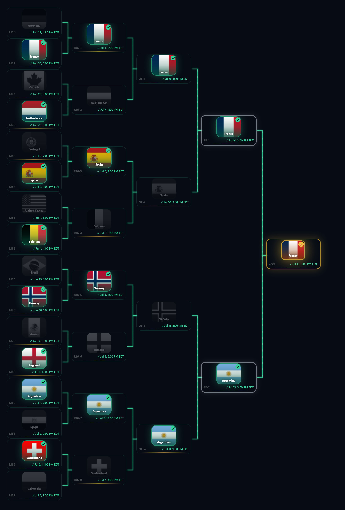

# 2026 World Cup Winner Prediction

An interactive web app for predicting the 2026 FIFA World Cup knockout stage champion. Features drag-and-drop and click operations with CS:GO Major-style team cards and animations.

> **Download**: [2026-World-Cup-Winner-Prediction.html](./2026-World-Cup-Winner-Prediction.html) — 单文件打包版，下载后直接双击在浏览器打开 | Standalone single-file build, open directly in browser.



## Live Demo

> Add deployment link here

## Features

- **Round of 32**: Based on the official FIFA 2026 World Cup knockout bracket
- **Drag & Click**: Click to select in R32, drag to advance from R16 onward
- **Auto Advance**: Drag anywhere — auto-highlights the next valid target
- **Cascade Gray**: Eliminated winners turn gray in previous rounds
- **Champion Gold**: Final winner gets a gold border and crown badge
- **Lock / Reset**: Freeze predictions for sharing, one-click reset
- **Export PNG**: Download bracket as high-quality (2x) PNG image
- **16 Languages**: 简体中文、繁體中文、English、Español、Português、Français、Deutsch、Nederlands、Italiano、Svenska、Norsk、Hrvatski、Bosanski、日本語、한국어、العربية
- **Timezone**: Match times auto-convert to local timezone
- **Responsive**: Works on mobile, tablet, and desktop

## Tech Stack

| Technology | Usage |
|------------|-------|
| React 18 + TypeScript | Frontend framework |
| Vite | Build tool |
| Tailwind CSS | Styling |
| @dnd-kit/core | Drag and drop |
| Framer Motion | Animations |
| Zustand | State management |
| html-to-image | Screenshot export |
| flagcdn.com | National flag images |

## Quick Start

```bash
# Install dependencies
npm install

# Start dev server
npm run dev

# Build for production
npm run build

# Preview production build
npm run preview
```

## Project Structure

```
src/
├── main.tsx              # Entry point
├── App.tsx               # Root component
├── index.css             # Tailwind + global styles
├── constants/
│   └── teams.ts          # 32 knockout teams (flags, names, 16 languages)
├── types/
│   └── index.ts          # TypeScript type definitions
├── store/
│   └── usePredictionStore.ts  # Zustand global state
├── utils/
│   ├── bracket.ts        # FIFA 2026 official knockout bracket
│   └── exportImage.ts    # html-to-image PNG export
└── components/
    ├── Layout.tsx         # Header (reset, lock, export, language)
    ├── BracketTree.tsx    # SVG connectors + match card grid
    ├── KnockoutStage.tsx  # DndContext + drag/click handlers
    ├── MatchNode.tsx      # Match card pair (React.memo)
    ├── TeamCard.tsx       # Single team card (flag bg, win/lose status)
    ├── TeamBadge.tsx      # Inline team badge
    ├── ExportButton.tsx   # Export PNG button
    ├── bracketLayout.ts  # Layout engine (X/Y, connectors, bounds)
    └── breakpoint.ts     # Responsive breakpoint detection
```

## Contributing

1. Fork the repo
2. Create a feature branch (`git checkout -b feature/xxx`)
3. Commit your changes (`git commit -m 'feat: xxx'`)
4. Push to the branch (`git push origin feature/xxx`)
5. Open a Pull Request

All PRs must pass security scan and code review before merging. See [SECURITY.md](./SECURITY.md).

## License

MIT License

---

# 2026 世界杯冠军预测

预测 2026 世界杯淘汰赛冠军的交互式 Web 应用。支持拖拽和点击操作，CS:GO Major 风格的战队卡片与动画效果。

> **下载**：[2026-World-Cup-Winner-Prediction.html](./2026-World-Cup-Winner-Prediction.html) — 单文件打包版，下载后直接双击在浏览器打开。


## 在线体验

> 部署后添加链接

## 功能

- **32 强淘汰赛**：基于 FIFA 官方 2026 世界杯淘汰赛对阵表
- **拖拽 + 点击**：32 强阶段点击选择，16 强后支持拖拽晋级
- **自动推进**：拖拽至任意位置，自动高亮下一个目标
- **级联置灰**：淘汰的晋级者在之前轮次中变为灰色
- **冠军特效**：最终冠军获得金色边框和皇冠徽章
- **锁定 / 重置**：冻结选择以截图分享，一键清空预测
- **导出 PNG**：2 倍清晰度导出对阵表图片
- **16 种语言**：简体中文、繁體中文、English、Español、Português、Français、Deutsch、Nederlands、Italiano、Svenska、Norsk、Hrvatski、Bosanski、日本語、한국어、العربية
- **时区转换**：比赛时间自动转换为本地时区
- **响应式布局**：适配手机、平板、桌面端

## 技术栈

| 技术 | 用途 |
|------|------|
| React 18 + TypeScript | 前端框架 |
| Vite | 构建工具 |
| Tailwind CSS | 样式 |
| @dnd-kit/core | 拖拽交互 |
| Framer Motion | 动画效果 |
| Zustand | 状态管理 |
| html-to-image | 截图导出 |
| flagcdn.com | 国旗图片 |

## 快速开始

```bash
# 安装依赖
npm install

# 启动开发服务器
npm run dev

# 构建生产版本
npm run build

# 预览构建结果
npm run preview
```

## 项目结构

```
src/
├── main.tsx              # 入口
├── App.tsx               # 根组件
├── index.css             # Tailwind + 全局样式
├── constants/
│   └── teams.ts          # 32 支淘汰赛队伍数据（国旗、名称、16 语言）
├── types/
│   └── index.ts          # TypeScript 类型定义
├── store/
│   └── usePredictionStore.ts  # Zustand 全局状态管理
├── utils/
│   ├── bracket.ts        # FIFA 2026 官方淘汰赛对阵表生成
│   └── exportImage.ts    # html-to-image PNG 导出
└── components/
    ├── Layout.tsx         # 顶栏（重置、锁定、导出按钮、语言切换）
    ├── BracketTree.tsx    # SVG 连接线 + 对阵卡片网格
    ├── KnockoutStage.tsx  # DndContext + 拖拽/点击处理
    ├── MatchNode.tsx      # 对阵卡片（React.memo）
    ├── TeamCard.tsx       # 单个队伍卡片（国旗背景、胜负状态）
    ├── TeamBadge.tsx      # 内联队伍徽章
    ├── ExportButton.tsx   # 导出 PNG 按钮
    ├── bracketLayout.ts  # 布局引擎（坐标、连接线、边界）
    └── breakpoint.ts     # 响应式断点检测
```

## 贡献

1. Fork 本仓库
2. 创建功能分支 (`git checkout -b feature/xxx`)
3. 提交更改 (`git commit -m 'feat: xxx'`)
4. 推送到分支 (`git push origin feature/xxx`)
5. 提交 Pull Request

所有 PR 需通过安全扫描和代码审查后合并。详见 [SECURITY.md](./SECURITY.md)。

## 许可

MIT License
